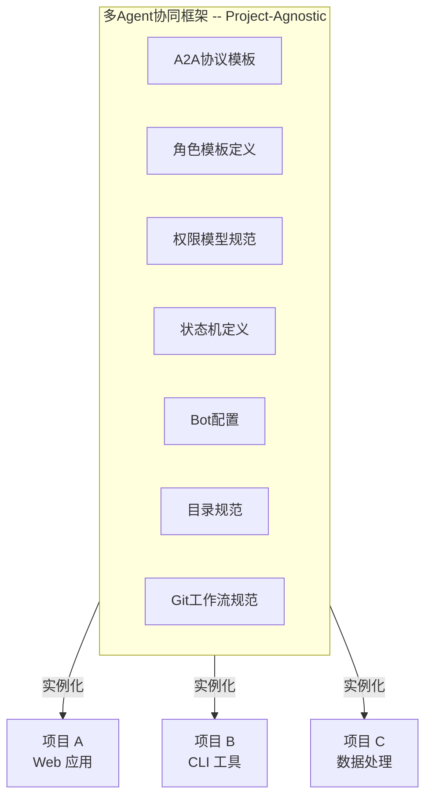
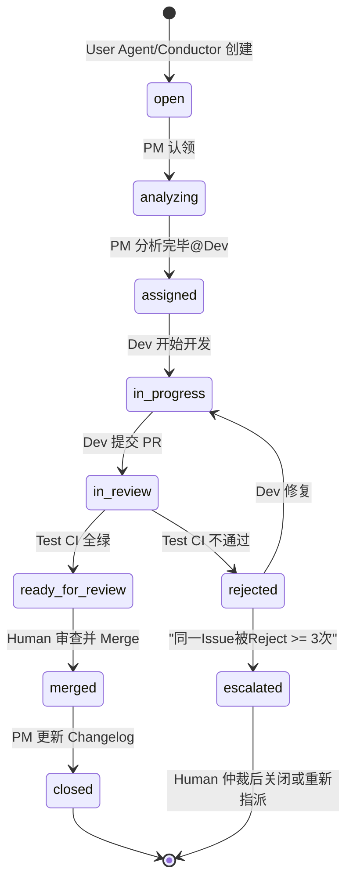
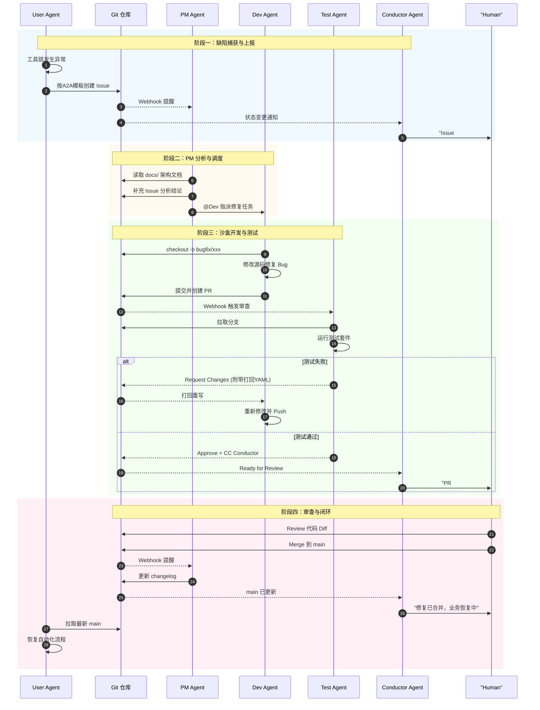
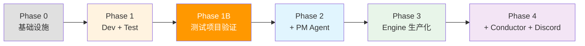
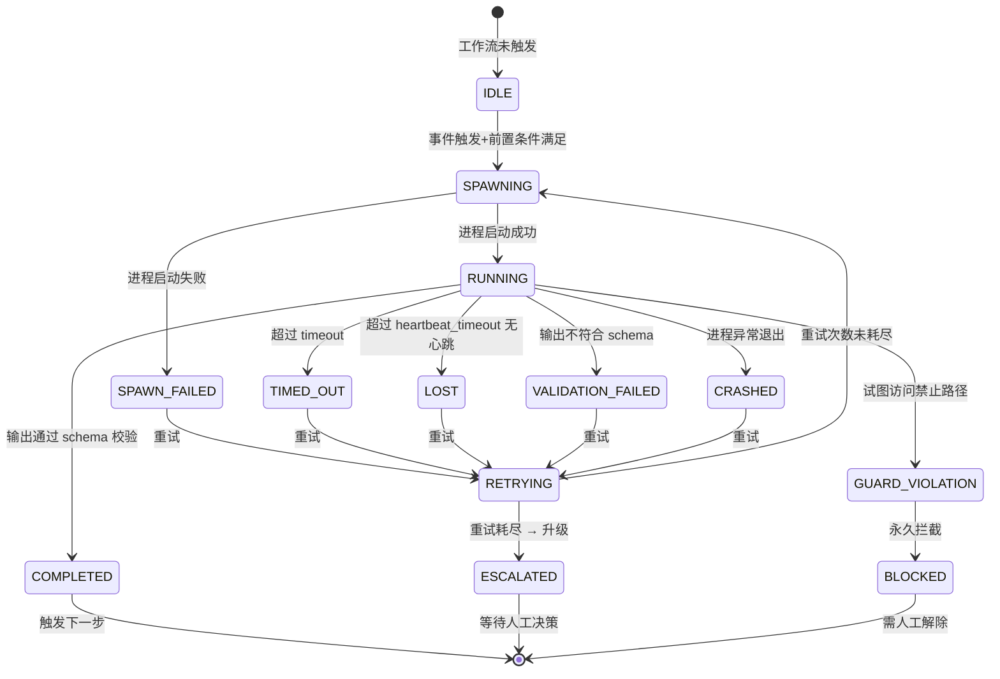
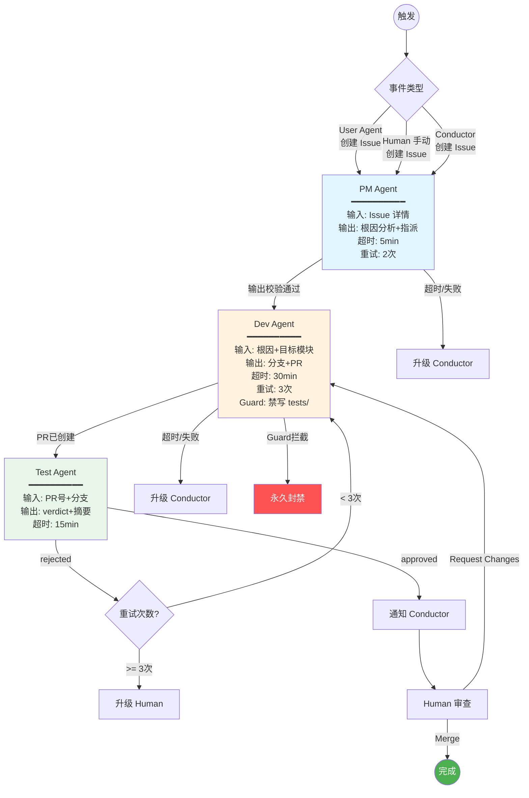
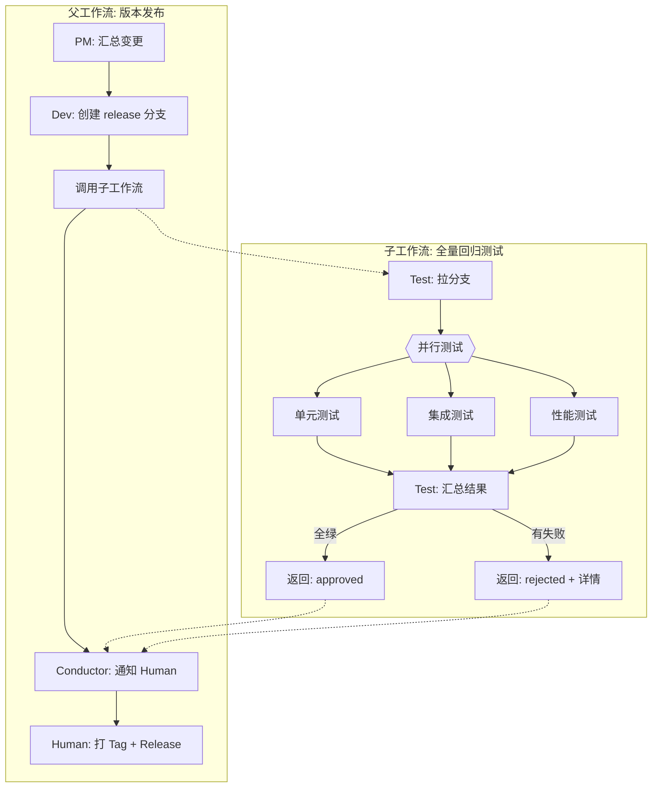

# 多智能体协同开发框架 — 任务书

> **版本**: v1.0  
> **状态**: 设计已完成，进入 Phase 0 实施阶段  
> **定位**: 通用多 Agent 协同开发框架。本项目与具体业务逻辑完全分离，可复用于任何需要多 Agent 协作的开发场景。

---

## 目录

- [一、项目概述](#一项目概述)
- [二、架构核心思想](#二架构核心思想)
- [三、框架与项目分离模型](#三框架与项目分离模型)
- [四、仓库目录结构规范](#四仓库目录结构规范)
- [五、Agent 角色矩阵与权限模型](#五agent-角色矩阵与权限模型)
- [六、Discord 控制台拓扑](#六discord-控制台拓扑)
- [七、A2A 结构化通信协议](#七a2a-结构化通信协议)
- [八、系统架构总图](#八系统架构总图)
- [九、Claude Code Channels 集成设计](#九claude-code-channels-集成设计)
- [十、实战场景走查](#十实战场景走查)
- [十一、分阶段实施计划](#十一分阶段实施计划)
- [十二、工作流引擎：确定性编排与错误恢复](#十二工作流引擎确定性编排与错误恢复)
- [十三、图模式 Agent 编排：DAG 引擎设计](#十三图模式-agent-编排dag-引擎设计)
- [附录 A：术语表](#附录-a术语表)
- [附录 B：待决议题清单](#附录-b待决议题清单)
- [附录 C：推荐 Skills 清单](#附录-c推荐-skills-清单)
- [附录 D：设计参考与社区验证](#附录-d设计参考与社区验证)

---

## 一、项目概述

### 1.1 背景与动机

单 Agent 开发模式存在五大系统性缺陷：

| # | 痛点 | 根因分析 |
|---|---|---|
| 1 | **上下文限制导致错误反复犯** | 单 Agent 会话上下文窗口有限，历史经验在长会话中丢失 |
| 2 | **文件目录管理混乱** | 缺少标准化目录结构，各组件自由读写同一空间 |
| 3 | **代码版本黑洞** | 大量版本堆积，无法区分每个版本改了什么、哪个能用 |
| 4 | **编码标准无法贯彻** | 无强制校验机制，完全依赖 Agent 自觉 |
| 5 | **单点幻觉无纠偏** | 单一 Agent 既写代码又自我评价，缺少对抗性验证环节 |

这些问题不是某个项目的特例，而是单 Agent 模式的**数学必然性**：每步 95% 可靠性下，20 步后成功率仅 36%。

### 1.2 项目目标

> 构建一套 **与具体项目解耦的通用多 Agent 协同开发框架**，通过 Discord + Git + 文件系统的三层架构，实现严格角色隔离、结构化通信、状态机托管的全自动开发流水线。

### 1.3 核心能力

- **多 Agent 编排**：Workflow Engine 驱动 Agent DAG，支持顺序、并行、条件分支、子工作流
- **角色隔离**：PM、Dev、Test 各自独立的工作区和权限，Dev 看不到测试用例，Test 改不了源码
- **A2A 结构化通信**：Agent 间通过 Git Issue/PR + YAML 模板通信，零自然语言歧义
- **硬约束执行**：Execution Guard 在操作系统级别拦截越权操作，Skill 软约束 + Guard 硬拦截双层防护
- **崩溃自主恢复**：state.db 持久化 + Saga 补偿事务 + 心跳检测，引擎崩溃后精确续传
- **远程指挥**：Human 通过 Discord 手机端只跟 Conductor 对话，所有下层 Agent 纯后台运行

---

## 二、架构核心思想

### 2.1 Conductor 指挥模式

整个系统的最高设计原则：**Human 只跟一个 Agent 对话**。

```
Human (手机 Discord)
    ↕  唯一的对话通道
Conductor Agent (总控)
    ↕  A2A协议 (文件系统 + Git)
下层Agent集群 (纯后台，无Discord)
```

- **Conductor** 是 Human 的代理人，负责翻译指令、分发任务、汇总状态、汇报结果
- **下层 Agent**（User Agent、PM、Dev、Test）全部纯后台运行，不暴露 Discord 接口
- **Discord 是外部操控界面**，不是系统内部通信通道。换掉 Discord（比如换 Telegram），系统内部零改动

### 2.2 控制面与数据面分离

| 平面 | 载体 | 职责 |
|---|---|---|
| **控制面** | Discord（仅 Conductor 一个 Bot）| Human 远程指挥入口 |
| **数据面** | Git + 文件系统 | Agent 之间的任务流转总线 |

**铁律**：Agent 之间永远不在 Discord 中互相通信。Discord 仅用于 Human ↔ Conductor 的 1 对 1 交互。

### 2.3 业务闭环与基建闭环物理隔离

| 闭环 | 关注点 | 载体 | 频率 |
|---|---|---|---|
| **业务闭环** | 项目的核心业务逻辑（由接入项目定义）| 文件系统 | 高频 |
| **基建闭环** | 修复/增强项目工具链和基础设施 | Git Issue/PR | 低频（按需触发）|

两个闭环通过 Conductor + A2A 协议连接：业务闭环遇到工具链缺陷时创建 Issue → PM 感知 → Dev 修复 → Test 验证 → Human Merge → 业务闭环自动恢复。

### 2.4 状态机托管

Agent 之间不存在非正式的对话交互。所有任务流转强制通过 Git Issue/PR 的状态机进行：

- **可追溯**：每个任务有完整的 Issue → PR → Merge 链路
- **防崩溃**：状态持久化在 Git 中，Agent 重启不丢上下文
- **可审计**：Human 通过 Conductor 随时查看完整生命周期

### 2.5 Human 唯一入口

Human 不直接操作下层 Agent。所有指令通过 Discord 发给 Conductor。Human 保留的唯一直接权限是 `git merge to main`。

### 2.6 设计参考与社区验证

| 项目 | 验证了什么 | 我们借鉴了什么 |
|---|---|---|
| **[OpenCode](https://github.com/anomalyco/opencode)** (161K Stars) | Subagent 权限模型、Skill 动态加载、75+ LLM 架构 | Agent 定义语法、只读扫描模式 |
| **[Octobots](https://www.epam.com/insights/ai/blogs/step-by-step-guide-to-building-a-multi-agent-claude-code-ai-development-team)** (EPAM 生产验证) | SQLite Taskbox IPC、独立 Claude Code 进程 per Agent、GitHub Issues 审计 | state.db WAL 模式、SOUL.md→SKILL.md、per-issue session |
| **Claude Code Dynamic Workflows** | "3+1" 并行探索+对抗验证 | 多路并行 + 汇总评审 |

**Octobots 关键经验（直接写入我们的设计约束）**：
1. SQLite 足够做 Agent 间 IPC——不需要 Redis
2. "Act, don't ask" 必须写入 SKILL.md
3. 测试不能是可选的——Execution Guard 强制
4. Session-per-ticket——每个 Issue 独立 session
5. 去重是关键——webhook/retry/manual 三路可能重复

---

## 三、框架与项目分离模型

### 3.1 设计原则



### 3.2 框架提供 vs 项目提供

| 层 | 提供内容 | 存放位置 |
|---|---|---|
| **框架层** | 角色模板、权限矩阵、A2A 协议、Issue/PR 模板、状态机定义、Bot 挂载配置 | `.framework/` |
| **Agent 运行时** | 各 Agent 的持久记忆、Skill 定义、工作区 | `.agents/` |
| **项目层** | 源码、测试用例、业务文档、运行结果、日志 | `src/`, `tests/`, `docs/`, `results/`, `logs/` |

### 3.3 通信设计

- **基建闭环**（PM↔Dev↔Test）：通过 Git Issue/PR，低频、需审计
- **业务闭环**（User Agent↔项目工具链）：通过文件系统，高频、大数据量
- **控制面**（Human↔Conductor）：通过 Discord，自然语言 + 图片附件

---

## 四、仓库目录结构规范

```
<project-root>/
│
├── .framework/                       # ═══ 框架层（通用，跨项目复用） ═══
│   ├── config/
│   │   ├── roles.yaml                # Agent角色定义
│   │   ├── discord-bots.yaml         # Discord Bot 注册与频道映射
│   │   └── state-machine.yaml        # Issue/PR 状态机流转规则
│   ├── templates/
│   │   ├── issues/
│   │   │   ├── anomaly_report.md     # User→PM 异常上报模板
│   │   │   └── task_assignment.md    # PM→Dev 任务指派模板
│   │   └── prs/
│   │       ├── bugfix_pr.md          # Dev→Test Bug修复PR模板
│   │       └── feature_pr.md         # Dev→Test 新功能PR模板
│   ├── protocols/
│   │   ├── a2a-spec.md               # A2A通信协议规范
│   │   └── yaml-schema.md            # YAML Frontmatter 必填字段定义
│   ├── skills/                       # 按角色组织的Skill定义
│   │   ├── conductor/SKILL.md
│   │   ├── pm/SKILL.md
│   │   ├── dev/SKILL.md
│   │   ├── test/SKILL.md
│   │   └── user-agent/SKILL.md
│   ├── channels/                     # Claude Code Channels 配置
│   │   └── bot-definitions.md
│   └── workflow/                     # 工作流引擎
│       ├── engine.py                 # 引擎核心
│       ├── definitions/              # 工作流 YAML 定义
│       └── state.db                  # 工作流状态持久化（SQLite）
│
├── .agents/                          # ═══ Agent运行时目录 ═══
│   ├── memory/                       # 各Agent的持久记忆
│   │   ├── conductor/
│   │   ├── pm/
│   │   ├── dev/
│   │   ├── test/
│   │   └── user-agent/
│   └── worktrees/                    # 隔离工作区（Dev/Test临时分支）
│
├── src/                              # ═══ 项目层 ═══
├── scripts/
├── tests/                            # 测试用例（Test Agent 管理）
├── docs/                             # 项目文档（PM Agent 读写）
│   ├── architecture/
│   ├── changelog.md
│   └── known_issues.md
├── results/                          # 业务输出（User Agent 读写）
├── logs/                             # 运行日志
├── .github/
│   ├── ISSUE_TEMPLATE/
│   └── PULL_REQUEST_TEMPLATE/
└── CLAUDE.md
```

---

## 五、Agent 角色矩阵与权限模型

### 5.1 六角色总览

| 角色 | 实体 | Discord 呈现 | 定位 |
|---|---|---|---|
| **Human** | 人类架构师 | Discord 用户 | 最终决策者，唯一 Merge 权限持有者 |
| **Conductor** | Claude Code | `@MultiAgent_Conductor` | 总控 Agent：Human 唯一入口，框架通用 |
| **User Agent** | Claude Code | 无（纯后台）| 业务闭环驱动者：由接入项目定义具体逻辑 |
| **PM Agent** | Claude Code | 无（纯后台）| 项目经理：监控 Issue、分析任务、指派 Dev |
| **Dev Agent** | Claude Code | 无（纯后台）| 研发工程师：在隔离分支修改源码，提交 PR |
| **Test Agent** | Claude Code | 无（纯后台）| 测试工程师：编写/管理测试用例，跑 CI，审批打回 |

> **关键设计**：
> - 只有 Conductor 有 Discord 呈现。其他 Agent 全部纯后台。
> - Conductor 是框架通用角色，不感知具体项目业务。换个项目只需替换 User Agent。
> - Conductor 可以管理下层 Agent：修改配置、Skill、memory。

### 5.2 Conductor 与 User Agent 的边界

| | Conductor | User Agent |
|---|---|---|
| **对话对象** | Human（唯一） | 项目工具链、外部服务 |
| **知道什么** | 所有 Agent 状态、Git Issue 进展、系统全局 | 业务数据、运行结果、性能指标 |
| **做什么** | 翻译指令→A2A 任务→分发→汇总→汇报 | 由接入项目定义（编译、测试、部署、数据处理等）|
| **通用性** | 框架通用 | 项目专用 |
| **Discord** | ✅ | ❌ |

### 5.3 权限矩阵

| 角色 | Git 权限 | 文件系统写 | 文件系统读 |
|---|---|---|---|
| **Human** | admin (唯一 Merge) | `*` | `*` |
| **Conductor** | read-only + write Issue | `.agents/memory/conductor/`，`.framework/` 配置 | `*` |
| **User Agent** | read-only | `results/`, `logs/`, `.agents/memory/user-agent/` | `src/`, `scripts/`, `docs/` |
| **PM Agent** | no code (写 Issue only) | `docs/`, `.agents/memory/pm/` | `src/`, `scripts/`, `tests/`, `docs/` |
| **Dev Agent** | branch only，禁止 push main | `src/`, `scripts/`, `.agents/memory/dev/` | `src/`, `scripts/`, `tests/`, `docs/` |
| **Test Agent** | read-only | `tests/`, `.agents/memory/test/` | `src/`, `scripts/`, `tests/` |

### 5.4 Dev 与 Test 的双向隔离规则

| 测试类型 | Dev 可见性 | 规则 |
|---|---|---|
| **CI 冒烟测试**（编译、语法、格式校验）| ✅ 可见 | Dev 可在本地自行运行 |
| **功能验收测试** | ❌ 不可见 | Test 不暴露用例源码 |
| **回归测试** | ❌ 不可见 | Test 打回时附带最小复现信息 |

**打回必须附带的信息（A2A 协议强制要求）**：

```yaml
---
rejection_info:
  test_id: "T-042"
  input_params: "size=1024, precision=float32"
  expected: "output < 0.01"
  actual: "output = 0.054 (+440%)"
  failure_location: "src/core/compute.cpp:142"
  stack_trace: |
    #0  compute() at compute.cpp:142
    #1  runner::execute() at runner.cpp:89
---
```

### 5.5 升级机制

Dev 同一 Issue 被 Test 打回 **3 次**后：
1. Issue 自动标记 `escalated` 标签
2. Conductor 感知后在 Discord 推送 Human
3. Human 介入仲裁

---

## 六、Discord 控制台拓扑

### 6.1 设计原则

Discord 是 Human 与 Conductor 之间的外部通信接口：

```
Human (手机/桌面 Discord)
    ↕  Claude Code Channels 官方插件
Conductor Agent (@MultiAgent_Conductor)
    ↕  A2A 协议 (文件系统 + Git)
下层 Agent (PM / Dev / Test / User Agent，全部纯后台)
```

### 6.2 频道划分

```
Discord 服务器
├── #指挥中心    → @MultiAgent_Conductor   [Human 唯一交互频道]
└── #系统告警    → @MultiAgent_Conductor   [紧急升级通知]
```

所有下层 Agent 均无 Discord Bot。

### 6.3 下层 Agent 的管理

| 管理操作 | 方式 |
|---|---|
| 修改 Agent 的 Skill 定义 | 编辑 `.framework/skills/<role>/SKILL.md` |
| 调整 Agent 的行为参数 | 编辑 `.framework/config/roles.yaml` |
| 更新 Agent 的记忆/知识 | 编辑 `.agents/memory/<role>/` |
| 重启/暂停 Agent | 通过 systemd 或进程信号 |
| 查看 Agent 运行日志 | 读取 `logs/` 目录 |

---

## 七、A2A 结构化通信协议

### 7.1 通信矩阵

| 发送方 | 接收方 | 通道 | 触发条件 | 载体 |
|---|---|---|---|---|
| Human | Conductor | Discord | 随时 | 自然语言 |
| Conductor | Human | Discord | 状态汇报/异常升级/图表推送 | 自然语言 + 图片附件 |
| Conductor | PM | Git Issue | Human 发起基建任务 | `task_assignment` 模板 |
| Conductor | User Agent | 文件系统 JSON | Human 发起业务指令 | `business_directive.json` |
| User Agent | Conductor | Git Issue | 工具链异常 | `anomaly_report` 模板 |
| PM | Dev | Git Issue 内 @提及 | 分析完毕指派任务 | `task_assignment` 模板 |
| Dev | Test | Git PR | 修复完成提交代码 | `bugfix_pr` / `feature_pr` 模板 |
| Test | Dev | PR Review Comment | CI 失败打回 | `rejection_info` YAML |
| Test | Conductor | PR Review Comment (CC) | CI 全绿 | `approval_review` 模板 |
| PM | Conductor | Git Issue 状态变更 | Issue 状态变化 | Webhook 通知 |

### 7.2 Issue 状态机



### 7.3 标准化模板

#### 7.3.1 异常上报模板 (User Agent → PM)

```markdown
---
name: "[自动化上报] 工具链异常"
about: 自动化流程中捕获的工具链崩溃
labels: bug, automated
---

### 🚨 异常元数据
- **触发模块**: `[如：core/compute]`
- **错误类型**: `[如：Segmentation fault / IndexError]`
- **环境参数**: `[如：input_size=1024]`

### 🛠️ 复现步骤
1. 运行命令：`./scripts/run.sh --config test.json`
2. 异常发生在：`src/core/compute.cpp` 第 142 行。

### 📜 核心报错堆栈
```cpp
// 精简后的报错日志
```
```

#### 7.3.2 Bugfix PR 模板 (Dev → Test)

```markdown
---
name: "[Bugfix] 任务名称"
---

### 🔗 关联 Issue
Fixes #<Issue编号>

### 💻 修改内容说明
- [x] 描述修改了什么
- [x] 描述为什么这样修改

### 🧪 给 Test Agent 的审核指令
@Test_Agent，请重点审核以下逻辑：
1. 运行 `tests/test_xxx`，确保通过。
2. 检查修改是否影响现有功能。
```

#### 7.3.3 打回评论模板 (Test → Dev)

````markdown
@Dev_Agent 修复未通过，请根据以下信息定位问题：

```yaml
rejection:
  test_id: "T-042"
  input_params: "size=1024, precision=float32"
  expected: "output < 0.01"
  actual: "output = 0.054 (+440%)"
  failure_point: "src/core/compute.cpp:142"
  stack_trace: |
    #0  compute() at compute.cpp:142
    #1  runner::execute() at runner.cpp:89
```

请修改后重新 push，打回次数: N/3。
````

### 7.4 通信契约的强制校验

1. **GitHub Issue Template**：`.github/ISSUE_TEMPLATE/` 下放置模板，自动强制使用
2. **PR Template**：`.github/PULL_REQUEST_TEMPLATE/` 下放置模板，创建时自动填充
3. **格式校验**：Test Agent 在 CI 前校验 PR 描述是否符合 YAML 规范

---

## 八、系统架构总图

### 8.1 三层全景总图

```mermaid
graph TD
    Human(("👤 Human"))

    subgraph "控制面 — Discord"
        CONDUCTOR["Conductor Agent<br/>Human唯一入口<br/>框架通用"]
    end

    subgraph "业务闭环层 — 文件系统"
        UA["User Agent<br/>纯后台<br/>项目专用"]
        TOOLS["项目工具链<br/>编译/测试/部署"]
    end

    subgraph "研发基建层 — Git"
        PM["PM Agent<br/>纯后台<br/>项目经理"]
        DEV["Dev Agent<br/>纯后台<br/>研发工程师"]
        TEST["Test Agent<br/>纯后台<br/>测试工程师"]
        GIT["Git 仓库<br/>Issue 与 PR"]
    end

    Human <-->|"Discord"| CONDUCTOR

    CONDUCTOR -->|"业务指令"| UA
    CONDUCTOR -->|"基建任务"| PM
    CONDUCTOR -->|"状态查询"| GIT

    UA -->|"驱动"| TOOLS
    TOOLS -->|"异常上报"| UA
    UA -->|"A2A: 异常Issue"| GIT
    
    GIT -->|Webhook| PM
    PM -->|@Dev指派| GIT
    DEV -->|PR| GIT
    GIT -->|触发CI| TEST
    TEST -->|Approved/Rejected| GIT
    GIT -->|"Ready for Review"| CONDUCTOR
    CONDUCTOR -->|"通知Human"| Human
    Human -->|Merge| GIT
    GIT -->|"状态变更"| CONDUCTOR
```

### 8.2 基建闭环时序图



---

## 九、Claude Code Channels 集成设计

### 9.1 概述

使用 Anthropic 官方 [Claude Code Channels 插件](https://deepwiki.com/anthropic/claude-plugins-official/9-messaging-channel-plugins)，将 Conductor Agent 接入 Discord。

```
Human (手机/桌面 Discord)
    ↕  Discord WebSocket
Claude Code Channels 官方插件
    ↕  进程通信
Conductor Agent (Claude Code 实例)
    ↕  A2A协议 (文件系统 + Git)
下层 Agent (PM / Dev / Test / User Agent)
```

### 9.2 Conductor 启动

```bash
claude plugin install discord@claude-plugins-official
claude --channels plugin:discord@claude-plugins-official
```

### 9.3 能力清单

| 能力 | 支持 |
|---|---|
| Human ↔ Conductor 文本消息 | ✅ |
| 图片/截图传输 | ✅ 最大 25MB |
| Conductor → Human 图表附件 | ✅ Mermaid 渲染后自动发送 |
| 安全认证 | ✅ 5字符配对码 + 白名单 |
| 消息历史 | ✅ 最近 100 条 |

### 9.4 会话隔离

- 下层 Agent 通过文件系统和 Git 运行，不占用 Discord 通道
- Conductor 从 `.agents/memory/conductor/` 恢复状态
- 下层 Agent 从各自的 `.agents/memory/<role>/` 恢复
- 权限隔离由文件系统权限 + Git 分支权限强制执行

---

## 十、实战场景走查

以 **"Dev Agent 修复 Bug 时 Test Agent 发现回归问题"** 为例：

1. **触发**: User Agent 调用工具链时捕获 `Segmentation fault`，按 A2A 模板创建 Issue `[Bug] compute.cpp 空指针崩溃`

2. **A2A 上报**: Git Webhook 通知 PM，Conductor 感知后在 Discord 推送 Human

3. **PM 分析**: PM 读取 Issue → 查阅 `docs/architecture/compute.md` → 定位到 `src/core/compute.cpp:142` → @Dev 指派

4. **沙盒修复**: Dev 执行 `git checkout -b bugfix/null-ptr` → 修改源码 → Push → 创建 PR

5. **自动化拦截**: Test 拉取分支 → 运行 CI → 发现回归测试吞吐量下降 → 在 PR 回复 rejection YAML

6. **修复循环**: Dev 根据 rejection 信息定位 → 修改 → Push → Test 全绿 → Approve

7. **Conductor 通知**: Discord 推送 "PR #43 全绿，请审查"

8. **Human 放行**: 手机 Review Diff → 点击 Merge

9. **闭环恢复**: PM 更新 changelog。User Agent 拉取 main → 恢复正常运行

---

## 十一、分阶段实施计划

> 策略：从最小可行编排开始，逐层叠加 Agent，每阶段用可靠性验证门禁确认无误后再进入下一阶段。

### 阶段总览



---

### Phase 0：基础设施搭建（预计 1 天）

**目标**：仓库结构就绪，模板生效。

#### 0.1 Agent 定义格式（借鉴 OpenCode + Octobots）

```yaml
# .framework/config/roles.yaml
agents:
  dev:
    description: "代码修复专家，在隔离分支工作"
    model: "deepseek/deepseek-chat"
    permissions:
      write: ["src/", "scripts/", ".agents/memory/dev/"]
      read:  ["src/", "scripts/", "docs/", "tests/"]
      deny:  ["tests/", "docs/"]
    personality: "methodical, careful, act-dont-ask"
    skill: ".framework/skills/dev/SKILL.md"
    memory: ".agents/memory/dev/"
    session: "per-issue"
    
  test:
    description: "测试工程师，只运行测试和审查代码"
    model: "deepseek/deepseek-chat"
    permissions:
      write: ["tests/", ".agents/memory/test/"]
      read:  ["src/", "scripts/", "tests/"]
      deny:  ["src/", "scripts/"]
    personality: "evidence-obsessed, skeptical"
    skill: ".framework/skills/test/SKILL.md"
    memory: ".agents/memory/test/"
    session: "per-pr"
```

#### 0.2 Taskbox 初始化

```sql
CREATE TABLE tasks (
    id TEXT PRIMARY KEY,
    type TEXT NOT NULL,
    source TEXT,
    workflow_id TEXT NOT NULL,
    current_step TEXT,
    status TEXT DEFAULT 'pending',
    retry_count INTEGER DEFAULT 0,
    dedup_key TEXT UNIQUE,
    created_at TEXT,
    claimed_at TEXT,
    completed_at TEXT
);
```

#### 🔍 门禁 0

| 检查项 | 通过标准 |
|---|---|
| Taskbox 并发去重 | 两个进程同时 INSERT 相同 dedup_key，一个被 UNIQUE 拒绝 |
| Issue 模板 | 自动填充，必填字段校验生效 |
| Agent 定义加载 | Claude Code 输出体现权限和人格约束 |

---

### Phase 1：Dev + Test 双 Agent 编排（预计 3-5 天）

**目标**：Workflow Engine 驱动 Dev→Test 最小闭环。

#### 1.1 最小工作流

```yaml
# .framework/workflow/definitions/dev-test.yaml
workflow:
  id: "dev-test-loop"
  trigger:
    type: git.issue
    filter:
      labels: ["bug"]
  
  steps:
    - id: dev_fix
      agent: dev
      timeout: 600
      retry: { max: 3, backoff: exponential }
      output:
        required: [branch_name, pr_number]
      guard:
        forbidden_paths: ["tests/", "docs/"]
      on_success:
        action: git.pr.create
    
    - id: test_verify
      agent: test
      depends_on: dev_fix
      timeout: 300
      output:
        required: [verdict, test_summary]
      on_verdict_rejected:
        next: dev_fix
        increment_global_retry: true
      on_verdict_approved:
        next: done

  error_policy:
    max_global_retries: 3
    escalation_target: "stdout"
```

#### 1.2 测试项目：C++ 命令行计算器

```
test-project/
├── src/
│   ├── main.cpp          # 主程序（故意留 Bug：参数解析越界）
│   └── calculator.cpp    # 计算逻辑（故意留 Bug：除零未处理）
├── tests/
│   ├── test_main.cpp
│   └── test_edge.cpp
├── scripts/build.sh
└── README.md
```

#### 1.3 演练场景

- **场景 A**：创建 Issue → Dev 修复 → Test 通过 → 完成 ✅
- **场景 B**：Dev 提交坏代码 → Test 打回 + rejection YAML → Dev 注入上次失败信息重试 → 通过
- **场景 C**：Dev 连续 3 次被打回 → Engine 停止并输出升级信息

#### 🔍 门禁 1（8 项）

| # | 检查项 | 通过标准 |
|---|---|---|
| 1.1 | 正常流程 | Dev→Test 全自动，无人工干预 |
| 1.2 | 打回修复循环 | Test 正确打回，Dev 第二次通过 |
| 1.3 | 三次打回终止 | Engine 输出升级信息 |
| 1.4 | Guard 拦截 | Dev 试图写 tests/ 被 GUARD_BLOCK |
| 1.5 | Agent 超时 | SIGTERM→SIGKILL，标记失败 |
| 1.6 | Engine 崩溃恢复 | state.db 恢复，断点续传 |
| 1.7 | 并发 Issue | 两个不互相干扰 |
| 1.8 | Schema 校验 | 输出缺字段触发重试 |

---

### Phase 1B：测试项目验证（预计 1 天）

| # | 检查项 | 通过标准 |
|---|---|---|
| 1B.1 | 全部 Bug 修复 | 2 个 Bug 自动修复并 CI 通过 |
| 1B.2 | 修复质量 | 不引入新 Bug |
| 1B.3 | Token 效率 | 低于预期上限 |
| 1B.4 | 端到端时间 | < 30 分钟 |

---

### Phase 2：接入 PM Agent（预计 3-4 天）

PM 自动分析 Issue、拆解任务、指派 Dev。

#### 🔍 门禁 2（6 项）

| # | 检查项 | 通过标准 |
|---|---|---|
| 2.1 | PM 正确分析 | root_cause 和 target_module 与 Bug 一致 |
| 2.2 | PM 不越权 | 未修改 src/ 代码 |
| 2.3 | 复杂度路由 | 正确判断 trivial/simple/medium/complex |
| 2.4 | 三 Agent 全链路 | PM→Dev→Test 顺序正确 |
| 2.5 | PM 分析超时 | Engine 正确重试或升级 |
| 2.6 | Dev 无响应 | Engine 重试，状态正确记录 |

---

### Phase 3：Engine 生产化（预计 3-4 天）

> **2026-06-20 调整**：原计划接入 AI User Agent，但 Phase 2 实践表明 Human-as-user + PM→Dev→Test 闭环已跑通，AI User Agent 与 Human + Test Agent 高度重叠。Phase 3 重心调整为 **Engine 生产化**：让 AgentSpawner 成为所有 Agent 调用的唯一入口，自动记录 metrics，支持并行工作流。User Agent 角色定义保留为框架骨架。

**核心目标**：Engine 从"代码存在但未使用"变成"生产可用的 Agent 调度层"。

#### 关键改造

| 改造项 | 当前状态 | 目标状态 |
|--------|---------|---------|
| Agent 调用入口 | 手动 `claude -p` | 全部通过 AgentSpawner |
| Metrics 记录 | 手动统计 | 自动写入 agent_metrics 表 |
| PM CLI | 直接 spawn 进程 | 调用 Orchestrator.run() |
| 并行执行 | 不支持 | fan-out 多步骤并行 |
| 心跳监控 | 代码存在未验证 | 实际检测 + 自动重试 |
| 崩溃恢复 | 代码存在未验证 | 实际断点续传测试 |

#### 🔍 门禁 3（6 项）

| # | 检查项 | 通过标准 |
|---|---|---|
| 3.1 | Engine 驱动完整流程 | `multiagent run` 执行 PM→Dev→Test，agent_metrics 表有完整记录 |
| 3.2 | 并行步骤执行 | 两个独立 Agent 同时运行，不互相阻塞，metrics 各自独立 |
| 3.3 | 心跳丢失恢复 | kill Agent 进程 → Engine 检测 lost → 自动重试 |
| 3.4 | Engine 崩溃恢复 | kill Engine → 重启后从 state.db 断点续传 |
| 3.5 | Metrics 自动记录 | 每次 Agent 调用自动写入，`multiagent metrics` 可查询 |
| 3.6 | PM CLI 走 Engine | `multiagent pm submit` 的 Agent 调用经过 AgentSpawner.monitor() |

---

### Phase 4：接入 Conductor + Discord（预计 2-3 天）

Human 通过 Discord 只跟 Conductor 对话。

#### 🔍 门禁 4（5 项）

| # | 检查项 | 通过标准 |
|---|---|---|
| 4.1 | Human→Conductor 对话 | 手机 Discord 正确响应 |
| 4.2 | 图表推送 | Mermaid→图片发送到 Discord |
| 4.3 | PR 审查通知 | Test 通过后 Human 收到通知 |
| 4.4 | 远程修改配置 | Human 说"提高超时"，Conductor 修改生效 |
| 4.5 | 全链路无人值守 | 只有 Merge 需要 Human 介入 |

---

### 耗时估算

| 阶段 | 预计 | 累计 |
|---|---|---|
| Phase 0 | 1 天 | 1 天 |
| Phase 1 | 3-5 天 | 4-6 天 |
| Phase 1B | 1 天 | 5-7 天 |
| Phase 2 | 3-4 天 | 8-11 天 |
| Phase 3 | 4-5 天 | 12-16 天 |
| Phase 4 | 2-3 天 | 14-19 天 |
| **总计** | **14-19 天** | |

### 关键风险

| 风险 | 对策 |
|---|---|
| Agent 上下文膨胀 | Phase 1 开始监控 Token，设置 context 上限 |
| Git API 限流 | Engine 重试 + 指数退避 |
| 资源不足（并行时） | Phase 3 前做单路压测 |
| API 不稳定 | Engine 重试 + 升级机制 |
| Discord 插件兼容性 | Phase 4 可降级为终端输出 |

---

## 十二、工作流引擎：确定性编排与错误恢复

### 12.1 设计哲学

> **Agent 是函数，不是自主决策者。**
> 工作流引擎决定「什么时候谁做什么」，Agent 只负责「当前这一步具体怎么做」。

参考 [Temporal](https://temporal.io/blog/of-course-you-can-build-dynamic-ai-agents-with-temporal) 和 [Source Code Agent 框架](https://ar5iv.labs.arxiv.org/html/2508.02721)：将工作流控制从 LLM 手中移走，减少 81.8% 工具调用、66.7% 对话轮次，提升 10.1% 成功率。

### 12.2 架构总览

```
                        ┌──────────────────────────────────────┐
                        │         Workflow Engine               │
                        │         (确定性进程，非 LLM)            │
                        │                                       │
Event Sources           │  ┌─────────────────────────────────┐  │
───────────────         │  │      State Machine               │  │
│ Git Webhook  │────────┼─→│  从 YAML 加载，持久化到 SQLite    │  │
│ inotifywait  │        │  └───────────────┬─────────────────┘  │
│ Cron Timer   │        │                  │                    │
───────────────         │  ┌───────────────▼─────────────────┐  │
                        │  │      Agent Spawner              │  │
                        │  │  构建上下文 → 启动 Agent 进程    │  │
                        │  │  → 监控心跳 → 收集输出 → 验证   │  │
                        │  │  → 更新状态 → 触发下一步         │  │
                        │  └───────────────┬─────────────────┘  │
                        └──────────────────┼────────────────────┘
                                           │
              ┌────────────────────────────┼────────────────────┐
              ▼                            ▼                    ▼
        ┌──────────┐                ┌──────────┐         ┌──────────┐
        │ PM Agent │                │ Dev Agent│         │Test Agent│
        │ 临时进程  │                │ 临时进程  │         │ 临时进程  │
        │ stdin:   │                │ stdin:   │         │ stdin:   │
        │ 具体任务  │                │ 具体任务  │         │ 具体任务  │
        │ stdout:  │                │ stdout:  │         │ stdout:  │
        │ JSON结果  │                │ JSON结果  │         │ JSON结果  │
        └──────────┘                └──────────┘         └──────────┘
```

### 12.3 Agent 生命周期



### 12.4 错误分类与恢复

| 错误类型 | 策略 | 示例 |
|---|---|---|
| **瞬时故障** | 指数退避重试 | API 限流、网络抖动 |
| **确定性失败** | 升级给 Conductor | Guard 拦截、Schema 校验失败 |
| **超时** | 重试 N 次后升级 | Agent 卡死、上下文过长 |
| **失联** | 心跳检测 + 重试后升级 | 进程僵死 |
| **部分成功** | Saga 补偿事务 | 代码已 push 但 PR 创建失败 |
| **引擎自身崩溃** | state.db 持久化 + 重启续传 | 断电、系统重启 |

### 12.5 崩溃恢复

```
引擎启动
    ↓
读取 state.db
    ↓
┌─ 有 running 状态的 step？
│   ├─ heartbeat 正常 → 继续等待
│   └─ heartbeat 超时 → 标记 lost → 重试
│
└─ 无 running 状态 → 等待新事件触发
```

所有 Agent 调用**幂等**。如果 Agent 已完成工作但引擎在记录结果前崩溃，重试时 Agent 检测到 Git 分支/PR 已存在，直接返回已有结果。

### 12.6 与 Execution Guard 的协同

| | Workflow Engine | Execution Guard |
|---|---|---|
| **职责** | 决定下一步做什么 | 阻止不该做的事 |
| **主动性** | 主动触发 Agent | 被动拦截操作 |
| **违反后果** | 步骤跳过 → 重试/升级 | 操作被 OS 级别拒绝 |

---

## 十三、图模式 Agent 编排：DAG 引擎设计

### 13.1 核心理念

> **每个 Agent 是一个图节点（Vertex），A2A 协议是边（Edge），工作流 YAML 是图的声明式定义。**

```
┌─────────────────────────────────────────────────────┐
│               Agent DAG 引擎                         │
│  节点 (Vertex)  = Agent 进程 (Claude Code 实例)       │
│  边 (Edge)      = A2A 协议 (输出→输入 映射)           │
│  条件分支        = switch/case (基于输出字段)          │
│  并行区域        = fan-out → fan-in (多 Agent 并发)    │
│  子图            = 嵌套工作流 (子 DAG 调用)            │
│  状态            = state.db (持久化当前节点位置)        │
└─────────────────────────────────────────────────────┘
```

### 13.2 基建修复工作流 DAG



### 13.3 子工作流嵌套



### 13.4 图模式 vs 线性流程

| | 线性流程 | 图模式 |
|---|---|---|
| Agent 执行 | 严格顺序 | DAG：并行+分支 |
| 并行 | 不支持 | fan-out/fan-in |
| 分支 | 只有成功/失败 | 多路 switch/case |
| 回退 | 固定 retry | 条件边回到任意前驱 |
| 嵌套 | 扁平 | 子工作流 DAG |
| 可视化 | 无 | YAML→dag-exporter→Mermaid |

---

## 附录 A：术语表

| 术语 | 说明 |
|---|---|
| **A2A** | Agent-to-Agent，Agent 之间的结构化通信协议 |
| **Conductor** | 总控 Agent：Human 唯一入口，框架通用 |
| **User Agent** | 业务闭环驱动者：由接入项目定义具体逻辑 |
| **PM Agent** | 项目经理：分析 Issue、拆解任务、指派 Dev |
| **Dev Agent** | 研发工程师：在隔离分支修改源码 |
| **Test Agent** | 测试工程师：管理测试用例，跑 CI，审批打回 |
| **Workflow Engine** | 确定性编排引擎，Agent 是函数，Engine 是调用者 |
| **Execution Guard** | 文件系统级硬拦截，OS 级别阻止越权操作 |
| **Taskbox** | SQLite 任务队列（借鉴 Octobots），Agent 间 IPC |
| **GNAP** | Git-Native Agent Protocol，社区 Git 编排协议 |

---

## 附录 B：待决议题清单

| # | 议题 | 状态 |
|---|---|---|
| 1 | PM 分析超时是否需要自动升级 | 暂置 |
| 2 | CI 格式校验用 Actions 还是 Test Agent | 暂置 |
| 3 | `roles.yaml` 完整字段定义 | 待细化 |
| 4 | `state-machine.yaml` 完整流转规则 | 待细化 |
| 5 | 各 Agent 的具体大模型选型（Claude vs DeepSeek）| 待定 |
| 6 | 接入项目的编码规范标准文档 | 待编写 |
| 7 | Conductor 管理下层 Agent 的具体接口 | 待设计 |
| 8 | GNAP `.gnap/` 目录结构是否引入 | 待评估 |

---

## 附录 C：推荐 Skills 清单

### 通用（已安装）

| 技能 | 安装命令 | 说明 |
|---|---|---|
| **find-skills** | `npx skills add vercel-labs/skills@find-skills -y -g` | 技能发现引擎 |
| **technical-writer** | `npx skills add shubhamsaboo/awesome-llm-apps@technical-writer -y -g` | 技术文档生成 |
| **canvas-design** | `npx skills add anthropics/skills@canvas-design -y -g` | 架构图/流程图 |
| **frontend-design** | `npx skills add anthropics/skills@frontend-design -y -g` | Web 界面设计 |

### 各角色推荐

| 角色 | 推荐技能 |
|---|---|
| **Conductor** | `planning-with-files`, `project-planner`, `brainstorming` (obra/superpowers) |
| **PM** | `architecture-decision-records` (wshobson/agents), `writing-plans` (obra/superpowers) |
| **Dev** | `systematic-debugging`, `test-driven-development` (obra/superpowers) |
| **Test** | `verification-before-completion`, `requesting-code-review` (obra/superpowers), `governance-claude-skill` |
| **User Agent** | `xlsx` (anthropics/skills), `writing-plans` (obra/superpowers) |

---

## 附录 D：设计参考与社区验证

| 参考项目 | 验证内容 | 借鉴点 |
|---|---|---|
| **OpenCode** (161K Stars) | Subagent 权限模型、75+ LLM | `roles.yaml` 语法、只读扫描 |
| **Octobots** (EPAM 生产) | SQLite IPC、per-agent 进程、GitHub 审计 | state.db WAL、SKILL.md、dedup |
| **Dynamic Workflows** (Anthropic) | 并行探索+对抗验证 | 多路并行+汇总评审 |

**我们的独特增量**：A2A 结构化协议、Execution Guard 硬约束、DAG 图编排、框架-项目分离、Engine 自主恢复——这些社区方案都不具备。
