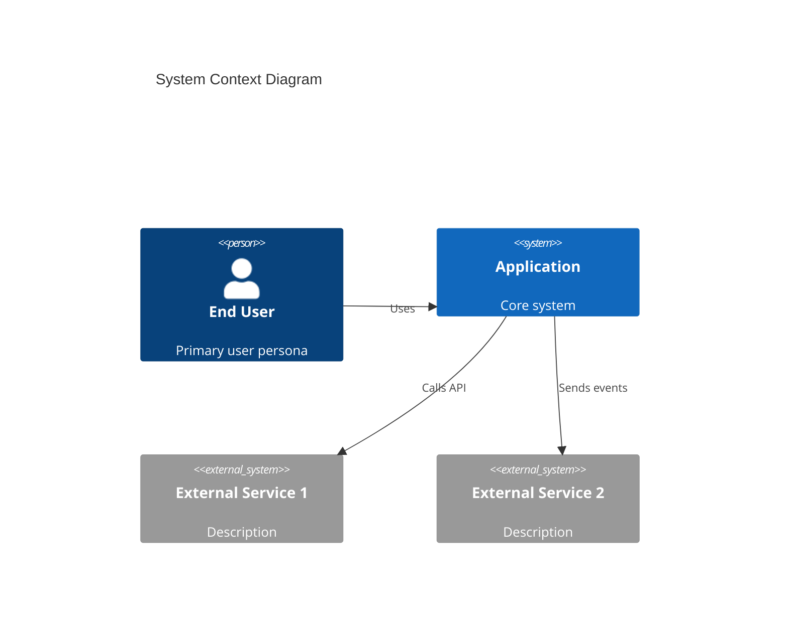
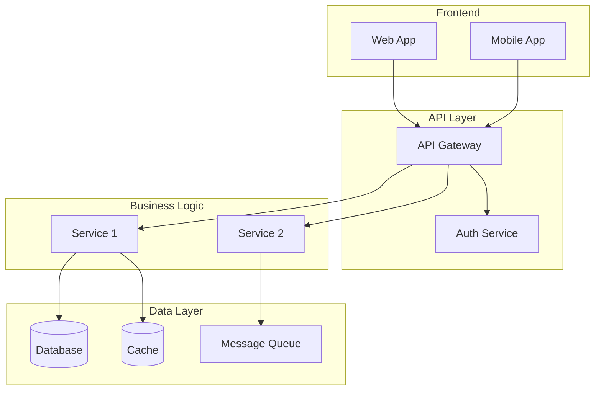
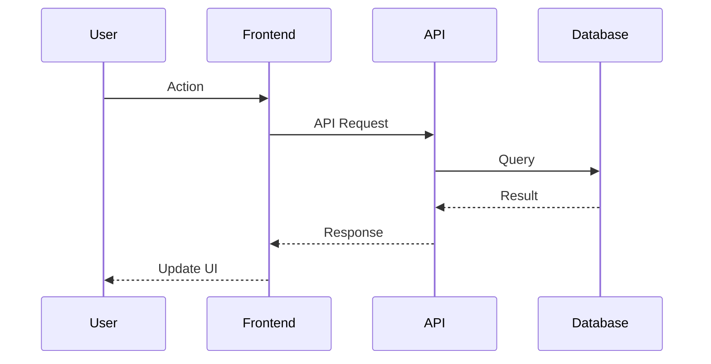
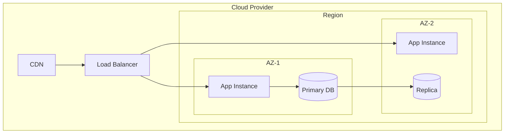

# Architecture Document Template

Use this template to generate the architecture document. Fill every section with project-specific content derived from the RE docs and user constraints. Do not leave placeholder text.

Generate 3-10 ADRs, focusing on consequential decisions. Flag all cost estimates as rough approximations. Use Mermaid C4 notation for system context diagrams where appropriate.

---

```markdown
# [Product Name] - Architecture Document

## 1. Architecture Overview

### 1.1 System Context Diagram



### 1.2 Architecture Style
[Monolith / Microservices / Serverless / Hybrid]
**Rationale:** [Why this style fits the constraints]

### 1.3 Key Design Principles
[From decision-rationale.md + user constraints]
- Principle 1: Description
- Principle 2: Description

---

## 2. Technology Stack

### 2.1 Core Technologies
| Layer | Technology | Version | Rationale |
|-------|-----------|---------|-----------|
| Language | [X] | [ver] | [why] |
| Framework | [X] | [ver] | [why] |
| Database | [X] | [ver] | [why] |
| Cache | [X] | [ver] | [why] |
| Queue | [X] | [ver] | [why] |

### 2.2 Infrastructure
| Component | Service | Rationale |
|-----------|---------|-----------|
| Compute | [EC2/ECS/Lambda/...] | [why] |
| Database | [RDS/Aurora/...] | [why] |
| Storage | [S3/EFS/...] | [why] |
| CDN | [CloudFront/...] | [why] |

---

## 3. System Architecture

### 3.1 Component Diagram



### 3.2 Service Boundaries
[From data-architecture.md Domain Model + decisions]

| Service | Responsibility | Domain | Dependencies |
|---------|---------------|--------|-------------|
| [Name] | [What it does] | [Domain] | [Other services] |

### 3.3 Data Flow



---

## 4. Data Architecture

### 4.1 Domain Model
[From data-architecture.md Domain Model / Bounded Contexts]

### 4.2 Data Models
[From data-architecture.md — adapted to target stack]

### 4.3 Data Flow
- Where data enters the system
- How it's transformed
- Where it's stored
- How it's accessed

### 4.4 Database Strategy
- Primary database: [type, why]
- Read replicas: [if applicable]
- Caching layer: [strategy]
- Data retention: [policy]

---

## 5. API Design

### 5.1 API Style
[REST / GraphQL / gRPC — with rationale]

### 5.2 Key Endpoints
[From data-architecture.md API Endpoints — adapted to target]

### 5.3 Authentication & Authorization
[From integration-points.md Auth Flows]

---

## 6. Infrastructure & Deployment

### 6.1 Infrastructure Diagram



### 6.2 Deployment Strategy
- CI/CD pipeline
- Blue/green or rolling deployments
- Environment strategy (dev, staging, production)

### 6.3 Scaling Strategy
[From operations-guide.md Scalability Strategy + user scale constraints]

### 6.4 Cost Estimation
[Based on cloud provider + scale expectations]
- Compute: $X/month
- Database: $X/month
- Storage: $X/month
- Network: $X/month
- **Total estimated:** $X/month

---

## 7. Security Architecture

### 7.1 Security Model
[From integration-points.md Auth + business-context Compliance]
- Authentication method
- Authorization model
- Data encryption (at rest, in transit)
- Secrets management

### 7.2 Compliance Requirements
[From business-context.md Business Constraints]

---

## 8. Observability

### 8.1 Logging
[From observability-requirements.md]

### 8.2 Monitoring & Alerting
[From observability-requirements.md]

### 8.3 SLAs & SLOs
[Based on scale expectations]

---

## 9. Architectural Decision Records

### ADR-001: [Decision Title]
**Status:** Accepted
**Context:** [What problem needed solving]
**Decision:** [What was decided]
**Rationale:** [Why this choice]
**Consequences:** [Trade-offs and implications]
**Alternatives Considered:** [What else was evaluated]

### ADR-002: [Decision Title]
...

[Generate ADRs for: architecture style, database choice, cloud provider,
 auth approach, API style, deployment strategy, and any other major decisions.
 Source from decision-rationale.md where available, generate new ones for
 target-state decisions.]

---

## 10. Migration Path (if applicable)

### 10.1 Current to Target State
[From technical-debt-analysis.md Migration Priority Matrix]

### 10.2 Migration Phases
- Phase 1: [Foundation — infrastructure, CI/CD]
- Phase 2: [Core — primary services, database]
- Phase 3: [Integration — external services, migration]
- Phase 4: [Optimization — performance, monitoring]

### 10.3 Risk Mitigation
- Rollback strategy
- Feature flags for gradual rollout
- Data migration approach
```
